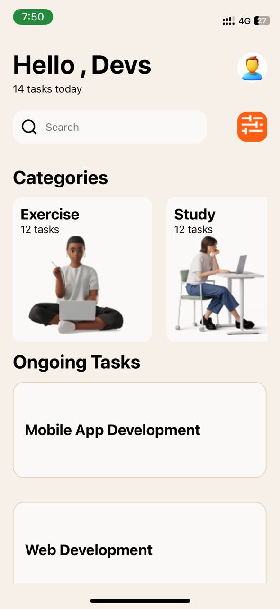

# rn-assignment3-11259806
DCIT 202 assignment 3

#Description of Task

This is a task manager app built using React Native. It allows users to organize their tasks into different categories and track their progress.

## Components Usage:

### 1. View:
   - Used to wrap other components and provide a layout structure.
   

### 2. Text:
   - Used to display text content.

### 3. ScrollView:
   - Used to create a scrollable container for content that exceeds the screen size and ensured all the tasks could be seen

### 4. TextInput:
   - Was used to accept user input in the search field

### 5. Stylesheet:
   - Used to define styles for components.

### 6. Button:
   - Used to create a clickable button component.

### 7. FlatList or SectionList:
   - Used to render lists under the categories and ongoing  section efficiently.

### 8. Image:
   - Used to display images in the app.

